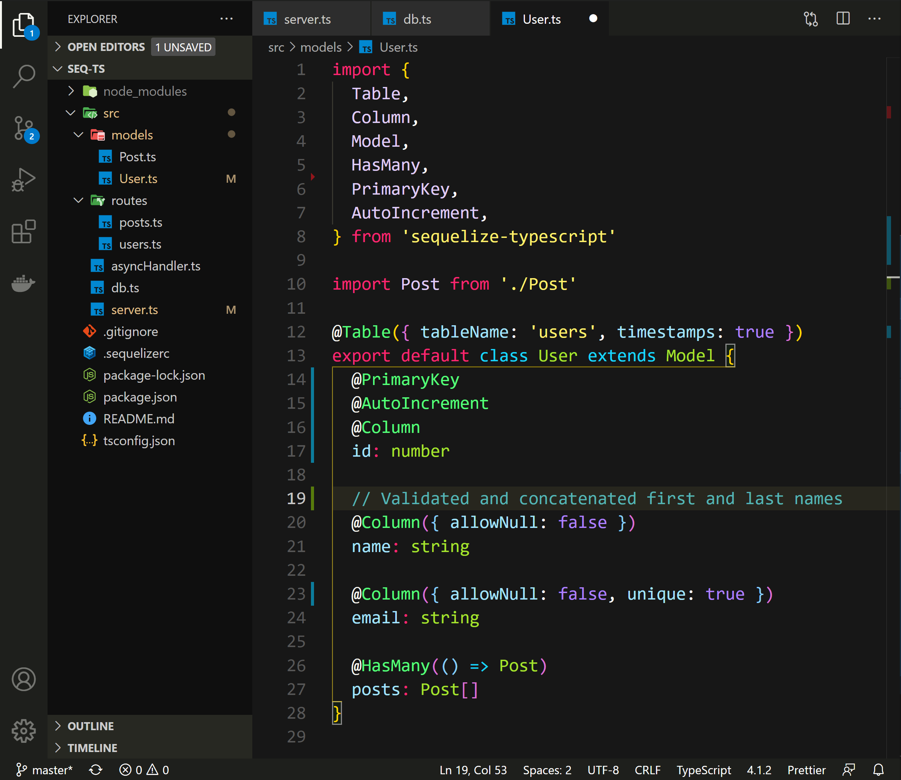

# Monokai Flow

> This theme is based on the beatiful [Monokai Dark Soda](https://github.com/AdamCaviness/vs-code-theme-monokai-dark-soda)

If there is an issue or something that put you off feel free to open an issue and I'll address it, thanks!
